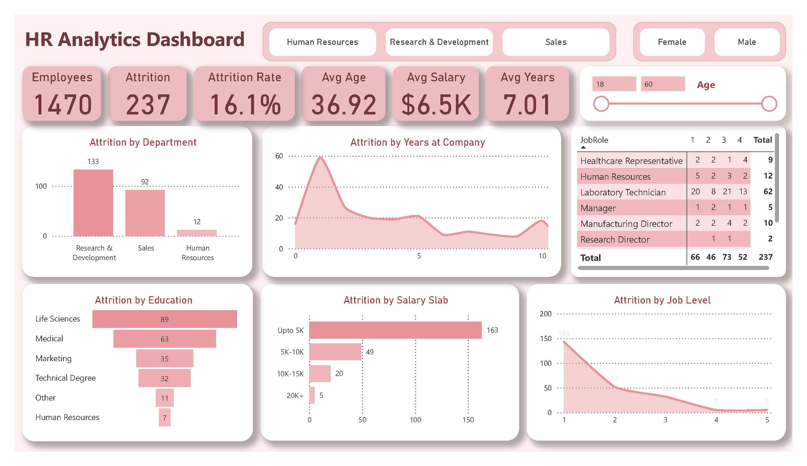

# Project Overview
The dashboard analyzes data from 1,470 employees to identify trends in attrition, which currently stands at 16.1%.

**Key Metrics**

1. Total Employees: 1,470
2. Total Attrition: 237
3. Attrition Rate: 16.1%
4. Average Age: 36.92 years
5. Average Salary: $6.5K
6. Average Tenure: 7.01 years

# Dashboard Preview

# Key Insights

**1. The "Early Years" Risk**

The Attrition by Years at Company chart shows a massive spike in departures within the first two years of employment. This suggests a potential gap in the onboarding process or a "reality shock" where the job role doesn't align with initial expectations.

**2. Salary vs. Retention**

There is a clear inverse relationship between salary and attrition. Employees earning "Upto 5K" represent the largest group of departures (163 out of 237). Once employees hit the $10K+ bracket, attrition drops significantly.

**3. Departmental Pressure**

The Research & Development department has the highest volume of attrition (133 employees). While it is likely the largest department, the sheer volume suggests that technical roles may be experiencing higher burnout or are being aggressively headhunted by competitors.

**4. Education & Role Impact**

Employees with a background in Life Sciences and Medical fields make up the bulk of the attrition. Furthermore, Laboratory Technicians have the highest attrition count (62) compared to any other job role.

# Recommendations
Based on the data, here are three strategic moves to reduce the 16.1% attrition rate:

**1. Revamp the "First 500 Days" Experience:**

Since attrition peaks early, focus on mentorship programs and "stay interviews" at the 6-month and 1-year marks to catch issues before the employee decides to leave.

**2. Benchmarking Entry-Level Pay:** 

The high turnover in the "Upto 5K" salary slab suggests that entry-to-mid-level compensation may not be competitive. A market salary review for these specific tiers (especially for Lab Technicians) could stem the tide of departures.

**3. Career Pathing for Job Level 1:** 

Attrition is highest at Job Level 1 (143 departures) and drops sharply afterward. Creating a clearer, faster pathway from Level 1 to Level 2 could give junior employees the "light at the end of the tunnel" they need to stay.
